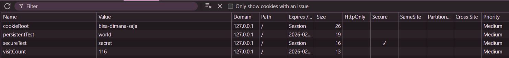
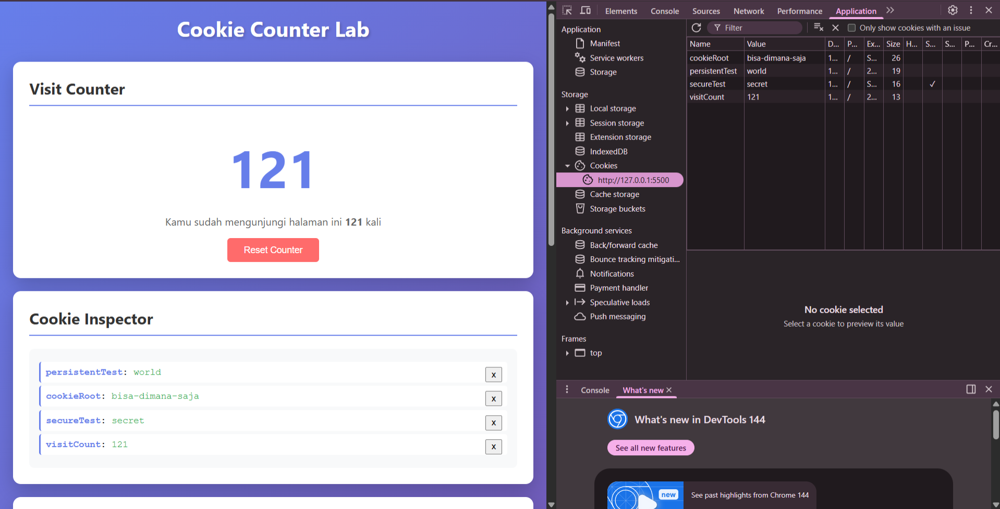
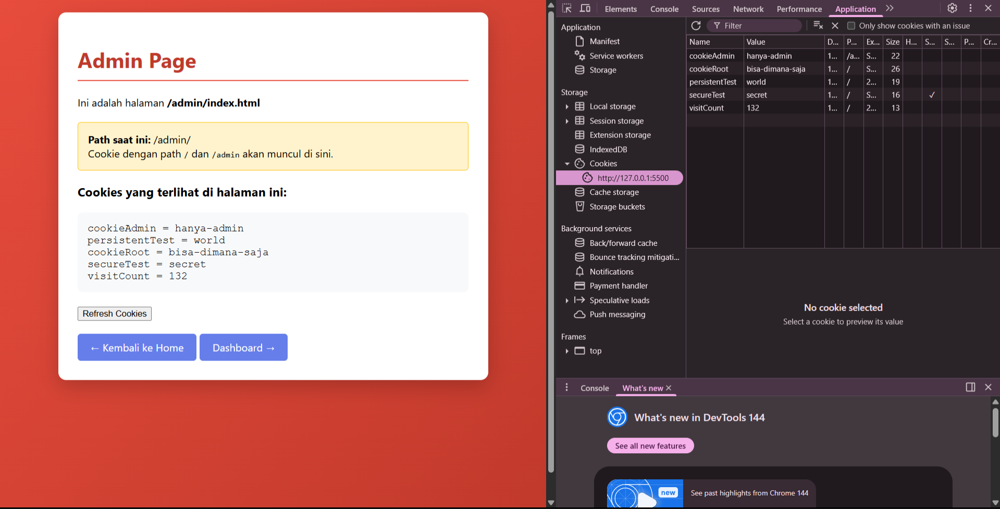
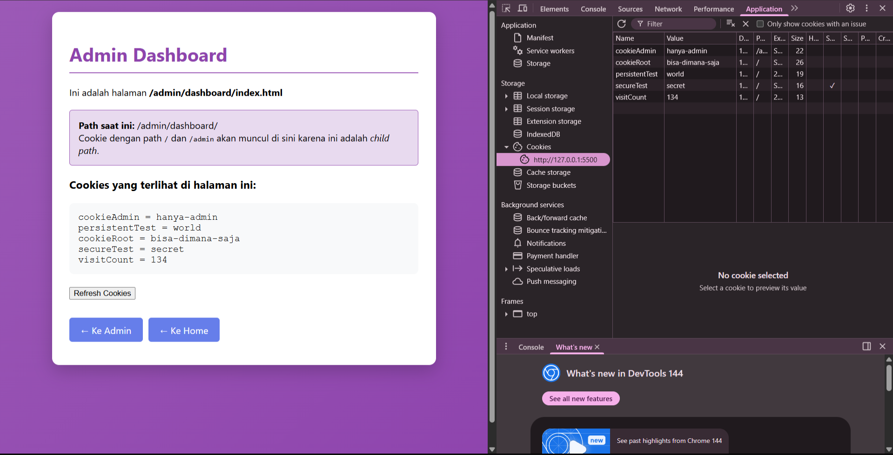

Eksperimen 1:
sessionTest: [hilang/ada?] Hilang
persistentTest: [hilang/ada?] Ada

Eksperimen 2:
| Halaman                         | cookieRoot | cookieAdmin |
|---------------------------------|------------|-------------|
| /index.html                     | ✓          | ✗           |
| /admin/index.html               | ✓          | ✓           |
| /admin/dashboard/index.html     | ✓          | ✓           |

Cookie dengan Path=/admin akan dikirim ke:
- /admin ✓ atau ✗? ✓
- /admin/dashboard ✓ atau ✗? ✓
- /profile ✓ atau ✗? ___
- / ✓ atau ✗? ✗

Eksperimen 3:
Cookie Secure tersimpan di localhost HTTP? Ya
Mengapa bisa tersimpan? Karena masih di dalam localhost

Pertanyaan refleksi:
Jawab pertanyaan berikut di bagian "Catatan Eksperimen":

1. Mengapa session cookie (tanpa Max-Age) berguna untuk login? *Karena tidak tersimpan -> menjaga keamanan*
2. Jika kamu membuat aplikasi e-commerce, atribut apa yang akan kamu gunakan untuk cookie session ID? Jelaskan alasannya. *Nama, nilai, dan max-age -> untuk memudahkan user masuk tanpa login-login ulang. Ini tidak berbahaya karena untuk pembayaran, tetap user asli yang bisa membayar menggunakan passwordnya.
3. Apa risiko keamanan jika cookie session TIDAK menggunakan HttpOnly? document.cookienya bisa diakses dan dikirim ke attacker
4. Kapan sebaiknya menggunakan Expires vs Max-Age? Saat ingin membuat session authentication, agar saat browser ditutup, cookienya hilang
5. Apa yang terjadi jika Domain cookie di-set ke .example.com? 

Deliverables
Kumpulkan:

1. 
2.  a. 
    b. 
    c. 